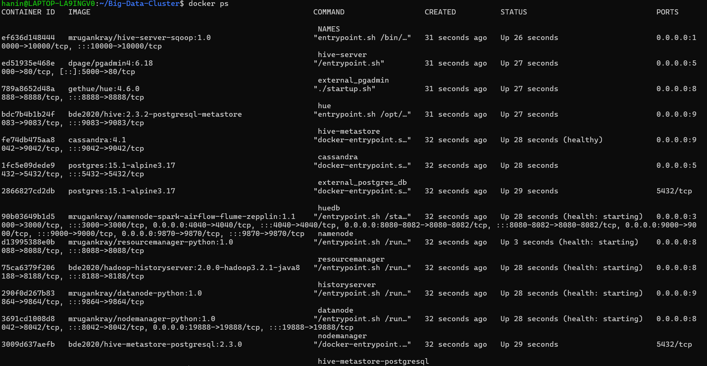
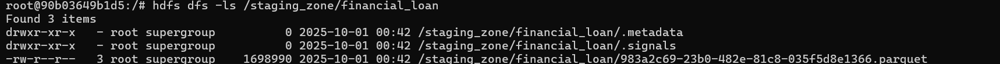
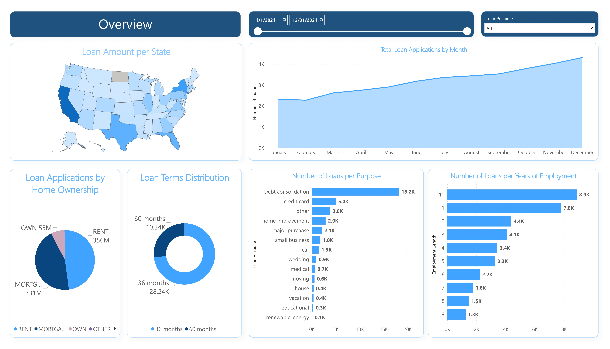
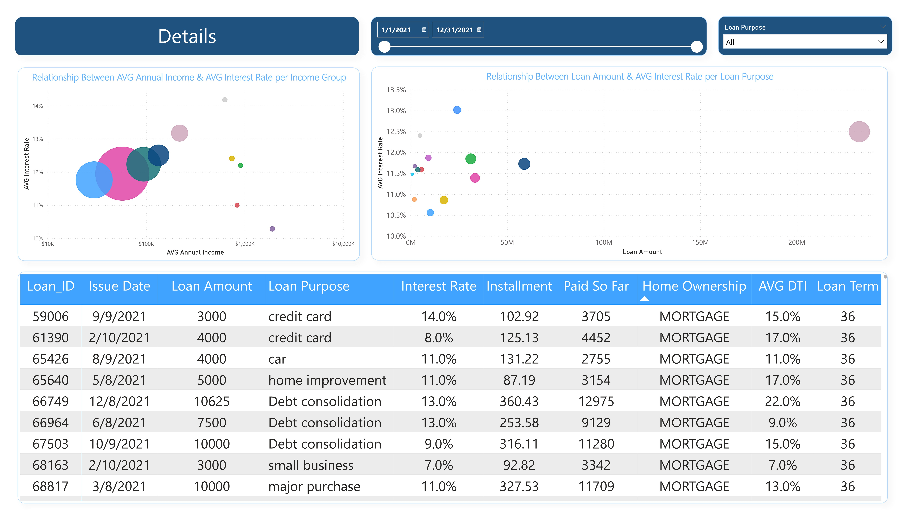

# Loan Default Prediction – Big Data ELT Pipeline  

## 📌 Overview  
This project demonstrates a **Big Data ELT Pipeline** for analyzing loan defaults.  
We start by setting up **Postgres inside Docker**, extract data with **Sqoop** into **HDFS**, perform transformations and modeling using **Spark in Zeppelin**, load the final tables into **Hive**, and finally visualize insights with **Power BI**. 

## 📊 Architecture

The following diagram illustrates the end-to-end architecture of the ELT pipeline:


---

## 🛠️ Tools & Technologies  
- **Docker** → Containerized environment for all services  
- **PgAdmin** (`http://localhost:5000/`) → Postgres database management  
- **Postgres** → Source database (raw financial loan dataset)  
- **Sqoop** → Data extraction from Postgres → HDFS  
- **HDFS** → Distributed storage for extracted data  
- **Spark (PySpark) in Zeppelin** (`http://localhost:8082/`) → Data cleaning, transformation, and dimensional modeling  
- **Hive** → Data warehouse for analytics  
- **Power BI** → Data visualization and dashboards  

---

## 🚀 Cluster Setup

## 1. Clone the repository:

   ```bash
git clone https://github.com/mrugankray/Big-Data-Cluster.git
cd Big-Data-Cluster
   ```


## 2. Start the cluster using Docker Compose:

   ```bash
sudo docker compose -f hive-sqoop-postgres-cassandra-docker-compose.yaml up
   ```


## 3. Verify that the containers are running:
   ```bash
docker ps
   ```

 

---

## 🔄 ELT Pipeline Steps  

### 1. Setup & Data Loading – Postgres  
📥 Load Data which in the [financial_loan_data/](financial_loan.csv) folder into Postgres (via pgAdmin)

**1.** Open pgAdmin

- Access pgAdmin at:

http://localhost:5000/

**2.** Login with your credentials.

- Create a new database (if not already created)

- Example: external database.

**3.** Upload CSV file from your local machine into the Postgres container

   ```bash
docker cp "/path/to/financial_loan.csv" external_postgres_db:/financial_loan.csv
   ```

**4.** Open SQL query tool in pgAdmin and create a table:

   ```bash
CREATE TABLE financial_loan(
		id BIGINT PRIMARY KEY,
		address_state VARCHAR(10),
		application_type VARCHAR(15),
	 	emp_length VARCHAR(15),
		emp_title VARCHAR(100),
		grade VARCHAR(3),
		home_ownership VARCHAR(15),
		issue_date VARCHAR(25),
		last_credit_pull_date VARCHAR(25),
		last_payment_date VARCHAR(25),
		loan_status VARCHAR(20),
		next_payment_date VARCHAR(25),
		member_id BIGINT,
		purpose VARCHAR(100),
		sub_grade VARCHAR(10),
		term VARCHAR(20),
		verification_status VARCHAR(30),
		annual_income NUMERIC(12, 2),
		dti NUMERIC(6, 5),
		installment NUMERIC(12, 2),
		int_rate NUMERIC(6, 5),
		loan_amount INT,
		total_acc INT,
		total_payment INT
)
   ```

**5.** Import data from CSV into the table using COPY command:

   ```bash
COPY financial_loan
FROM '/financial_loan.csv'
DELIMITER ','
CSV HEADER;
   ```

**6.** Verify data load:

   ```bash
SELECT * FROM financial_loan LIMIT 10;
   ```

  

---

## 2. Data Extraction – Sqoop

* Opened Sqoop inside the Hive container:

    ```bash
    docker exec -it hive-server bash
    ```

* Ran Sqoop import command:

    ```bash
    sqoop import \
    --connect jdbc:postgresql://external_postgres_db/postgres \
    --username external \
    --password external \
    --table financial_loan \
    --target-dir /staging_zone/financial_loan \
    --as-parquetfile \
    --m 1
    ```
Sqoop command execution inside container
HDFS file listing showing imported financial_loan data

---

## 3. Data Storage – HDFS

* Data from Postgres was successfully stored in HDFS.

* Example path: /staging_zone/financial_loan

 

HDFS listing with imported datase

---

## 4. Data Transformation & Modeling – Spark (Zeppelin)

* Opened Zeppelin on:

http://localhost:8082/

* Performed transformations in PySpark:
  
    * Data cleaning (null handling, formatting, standardization).
      
    * Feature engineering (e.g., debt-to-income ratio).
      
    * Dimensional modeling: split the raw financial_loan into:
      
        * **Fact Table:** fact_loan
          
        * **Dimension Tables:** dim_borrowers, dim_loan_Term, dim_status, dim_Credit_grade, dim_Date
          
  


 All PySpark transformation scripts are available in the [Spark_Transformations/](Spark_Transformations.ipynb/) folder.

---

## 5. Data Warehouse – Hive

- After transformation, we saved the modeled tables into Hive:

    ```bash
    financial_df.write.mode("overwrite").format("hive") .saveAsTable("default.financial_loan_cleaned")
    dim_borrowers.write.mode("overwrite").format("parquet").saveAsTable("dim_borrowers")
    dim_status.write.mode("overwrite").format("parquet").saveAsTable("dim_status")
    dim_credit_grade.write.mode("overwrite").format("parquet").saveAsTable("dim_credit_grade")
    dim_loan_term.write.mode("overwrite").format("parquet").saveAsTable("dim_loan_term")
    df_dates.write.mode("overwrite").format("parquet").saveAsTable("dim_date")
   fact_loan.write.format("parquet").mode("overwrite").saveAsTable("fact_loan")
     ```
    
    
  
---

## 6. Data Visualization – Power BI

* Connected Power BI to Hive using ODBC connector.


- In the summary dashboard, you can click on filters for Purpose, Grade, and Verification Status to explore bank loan data for the year 2021.  
- View Total Loan Applications, Total Funded Amount, and Total Amount Received.  
- See Average Interest Rate and Average Debt-to-Income Ratio (DTI), along with monthly averages and growth rates.  
- Explore information on Good Loan Issued, Bad Loan Issued, and Loan Status.  
---

- In the overview dashboard, filters for Purpose, Grade, and Verification Status are available.  
- Explore a summary of monthly data and bank loan details for each state in the U.S.  
- Analyze loan terms, borrower's years of employment, loan purposes, and homeowner status.  
- Clicking on diagrams updates the data interactively across all charts and tables.  
---

- In the details dashboard, filters for Purpose, Grade, and Verification Status can be applied.  
- Click on main table headers to sort and filter loan data.  
- Scroll through the main table to view all loan records for banks in 2021.  
---
## 7. Explanation of Terms Used in the Report

**MTD (Month-to-Date):** Refers to the cumulative total for the current month up to the current date.

**MoM (Month-over-Month):** Represents the percentage or absolute change compared to the previous month.

**DTI (Debt-to-Income Ratio):** DTI measures the borrower's debt burden relative to income. It gauges the borrower's capacity to take on additional debt.

**Good Loan:** This category includes loans with a loan status of 'Fully Paid' and 'Current.'

**Bad Loan:** This category specifically includes loans with a loan status of 'Charged Off.'

**Grade:** Grade represents a risk classification assigned to the loan based on creditworthiness. Higher grades signify lower risk. Sub Grade refines the risk assessment within a grade, providing additional risk differentiation.

**Verification Status:** Verification Status indicates whether the borrower's financial information has been verified. It assesses data accuracy.

**Loan Status:** Loan Status indicates the current state of the loan (e.g., fully paid, current, default). It tracks loan performance.
