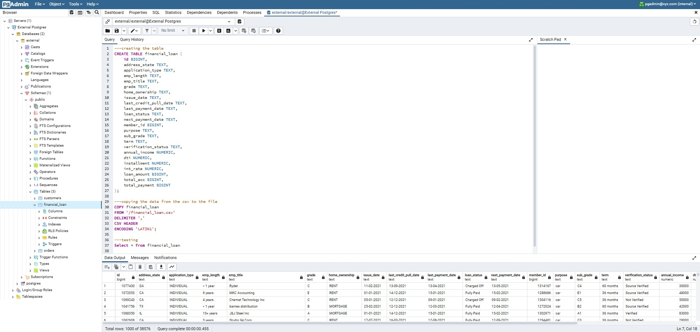
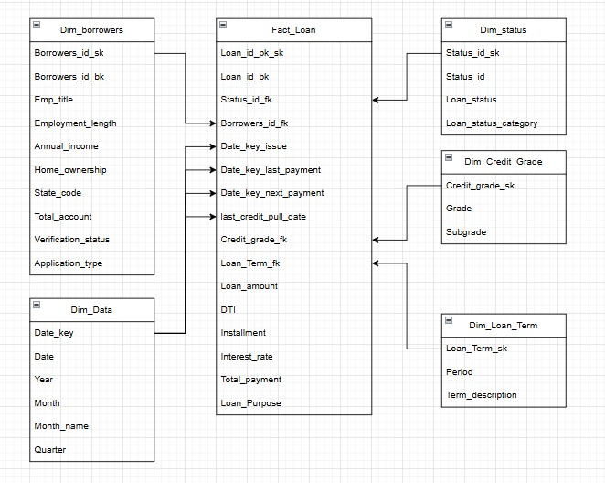
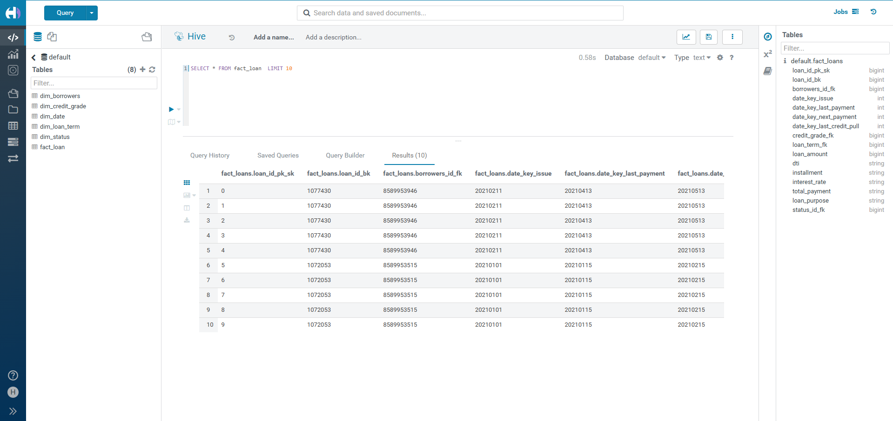

# Loan Default Prediction – Big Data ETL Pipeline  

## 📌 Overview  
This project demonstrates a **Big Data ETL Pipeline** for analyzing loan defaults.  

We start by setting up **Postgres inside Docker**, extract data with **Sqoop** into **HDFS**, perform transformations and modeling using **Spark in Zeppelin**, load the final tables into **Hive**, and finally visualize insights with **Power BI**.  

---

## 🛠️ Tools & Technologies  
- **Docker** → Containerized environment for all services  
- **PgAdmin** (`http://localhost:5000/`) → Postgres database management  
- **Postgres** → Source database (raw financial loan dataset)  
- **Sqoop** → Data extraction from Postgres → HDFS  
- **HDFS** → Distributed storage for extracted data  
- **Spark (PySpark) in Zeppelin** (`http://localhost:8082/`) → Data cleaning, transformation, and dimensional modeling  
- **Hive** → Data warehouse for analytics  
- **Power BI** → Data visualization and dashboards  

---

🚀 Cluster Setup

**1.** Clone the repository:

git clone https://github.com/mrugankray/Big-Data-Cluster.git
cd Big-Data-Cluster


**2.** Start the cluster using Docker Compose:

sudo docker compose -f hive-sqoop-postgres-cassandra-v2-docker-compose.yaml up


**3.** Verify that the containers are running:

docker ps

 

---

## 🔄 ETL Pipeline Steps  

### 1. Setup & Data Loading – Postgres  
- Opened **PgAdmin** on:  
http://localhost:5000/
- Created a database and loaded the `financial_loan` table into Postgres.  

  
- PgAdmin interface showing `financial_loan` table.  
- Terminal output confirming data is available in Postgres.  

---

## 2. Data Extraction – Sqoop

* Opened Sqoop inside the Hive container:

    ```bash
    docker exec -it hive-server bash
    ```

* Ran Sqoop import command:

    ```bash
    sqoop import \
    --connect jdbc:postgresql://external_postgres_db/postgres \
    --username external \
    --password external \
    --table financial_loan \
    --target-dir /staging_zone/financial_loan \
    --as-parquetfile \
    --m 1
    ```
Sqoop command execution inside container
HDFS file listing showing imported financial_loan data

---

## 3. Data Storage – HDFS

* Data from Postgres was successfully stored in HDFS.

* Example path: /staging_zone/financial_loan

 

HDFS listing with imported datase

---

## 4. Data Transformation & Modeling – Spark (Zeppelin)

* Opened Zeppelin on:

http://localhost:8082/

* Performed transformations in PySpark:
  
    * Data cleaning (null handling, formatting, standardization).
      
    * Feature engineering (e.g., debt-to-income ratio).
      
    * Dimensional modeling: split the raw financial_loan into:
      
        * **Fact Table:** fact_loan
          
        * **Dimension Tables:** dim_borrowers, dim_loan_Term, dim_status, dim_Credit_grade, dim_Date
          
  

- Zeppelin notebook running PySpark transformations.

- ERD diagram showing Fact and Dimension tables.

---

## 5. Data Warehouse – Hive

- After transformation, we saved the modeled tables into Hive:

    ```bash
    financial_df.write.mode("overwrite").format("hive") .saveAsTable("default.financial_loan_cleaned")
    dim_borrowers.write.mode("overwrite").format("parquet").saveAsTable("dim_borrowers")
    dim_status.write.mode("overwrite").format("parquet").saveAsTable("dim_status")
    dim_credit_grade.write.mode("overwrite").format("parquet").saveAsTable("dim_credit_grade")
    dim_loan_term.write.mode("overwrite").format("parquet").saveAsTable("dim_loan_term")
    df_dates.write.mode("overwrite").format("parquet").saveAsTable("dim_date")
   fact_loan.write.format("parquet").mode("overwrite").saveAsTable("fact_loan")
     ```
    
    
  
---

## 6. Data Visualization – Power BI

* Connected Power BI to Hive using ODBC connector.

* Built dashboards analyzing:

    * 
      
    * 
      
    * 

  
  
   
